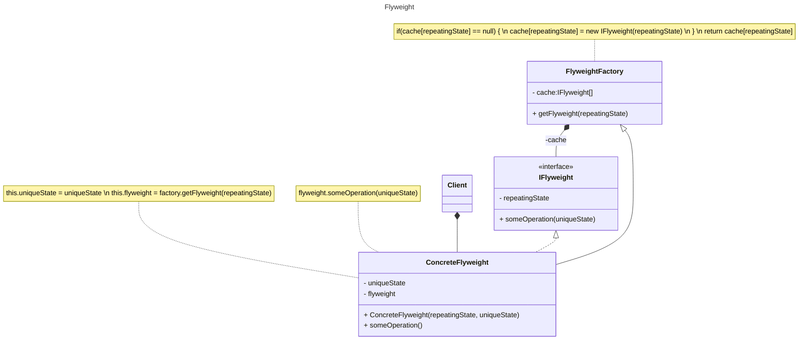

 
# `Flyweight`  

### Призначення та застосування патерну  
#### **Легковаговик** (*Flyweight*) — це структурний шаблон проєктування, який дає змогу оптимізувати використання оперативної пам’яті шляхом зменшення обсягу збережених об'єктів. Він досягає цього за рахунок розподілення спільного стану між об’єктами, замість дублювання однакових даних у кожному екземплярі.  

###### Патерн Flyweight забезпечує ефективне управління великою кількістю об’єктів шляхом використання механізму спільного доступу до їхнього внутрішнього стану. Наприклад, сучасні **веб-браузери** застосовують цей підхід для уникнення повторного завантаження однакових зображень. Усі нові зображення з Інтернету зберігаються у внутрішньому кеші, тоді як для вже завантажених створюється спеціальний об’єкт, що містить унікальні атрибути (наприклад, положення на сторінці), але посилається на кешовані дані.  

#### **Застосування:**  
Патерн Flyweight доцільно використовувати в таких випадках:  
- коли в програмі **експлуатується велика кількість об'єктів**, що може призвести до надмірного споживання пам’яті;  
- коли існують **значні витрати оперативної пам’яті**, спричинені зберіганням однакових даних у багатьох об'єктах;  
- коли **значну частину стану об'єктів можна винести за межі їхніх класів**, спрощуючи їхню структуру;  
- коли **великі групи схожих об'єктів можуть бути замінені меншою кількістю об'єктів** шляхом розділення їхнього спільного стану.  

### Діаграми класів та стану  

##### **Діаграма класів Flyweight:**  

##### **Діаграма стану Flyweight:**  

### Опис основних структурних елементів  
- **FlyweightFactory** — відповідає за створення та повторне використання об'єктів *flyweight*. Якщо об’єкт із заданим станом вже існує, фабрика повертає його, інакше — створює новий екземпляр.  
- **IFlyweight** — інтерфейс, що містить **внутрішній стан**, спільний для багатьох об'єктів.  
- **ConcreteFlyweight** — реалізує інтерфейс *IFlyweight*, містить **зовнішній стан**, що є унікальним для кожного окремого об'єкта.  
- **Client** — відповідає за створення або отримання екземпляра *ConcreteFlyweight* та управління ним.  

###### Діаграма станів демонструє реалізацію патерну Flyweight у середовищі C# Visual Studio для генерації графічних об'єктів, таких як лінії та овали.  

### Джерела інформації:  
- [refactoring.guru](https://refactoring.guru/design-patterns/flyweight)  
- [sourcemaking.com](https://sourcemaking.com/design_patterns/flyweight)  
- [medium.com](https://medium.com/@rajeshvelmani/lightweight-objects-for-efficient-performance-exploring-the-flyweight-design-pattern-in-java-4595ebfa3165)  
- [www.digitalocean.com](https://www.digitalocean.com/community/tutorials/flyweight-design-pattern-java)  

****
